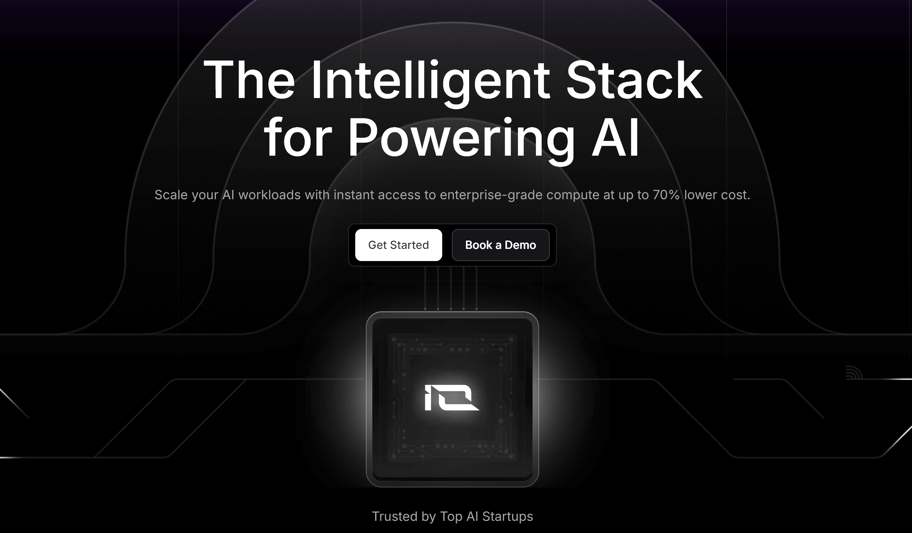

  

# Learn io.net AI

io.net offers a comprehensive suite of open-source large model inference, knowledge base, GPU cloud, and training services. Most services are free with generous token quotas — ideal for learning about large models or building prototype applications.

This course covers the basic usage of io.net's various AI and cloud services, with progressive tutorials from API calls to agent orchestration.

> Available in [English](en_version/) and [Chinese (中文)](cn_version/).

## Course Outline

| # | Module | Notebooks | Description |
|---|--------|-----------|-------------|
| 1 | [Model Service](en_version/1-ionet_model_service/) | `io_intelligence_api` · `multimode` · `langchain` | IO Intelligence API basics, multimodal models, LangChain integration |
| 2 | [Basic Agent](en_version/2-ionet_basic_agent/) | `basic_agent` · `complex_agent` | Build simple and multi-step agents with IO Intelligence |
| 3 | [RAG](en_version/3-ionet_rag/) | `rag_basic` · `rag_more` · `rag_dag` · `graph_detail` | Retrieval-Augmented Generation from basics to graph RAG |
| 4 | [Agentic Workflow](en_version/4-ionet_agentic_workflow/) | `agent_workflow_web` · `agent_sdk` | Web-based agent workflows and Agent SDK |
| 5 | [Train Service](en_version/5-ionet_train_service/) | `ionet_train` | Fine-tuning models on IO Cloud GPUs |
| 6 | [IO Cloud](en_version/6-ionet_cloud/) | `cloud_basic` · `cloud_vm` · `cloud_docker` · `cloud_ray` | GPU cloud: VMs, Docker containers, Ray clusters |
| 7 | [Agent Cloud](en_version/7-agent_cloud/) | `mcp_tutorial` · `agent_tutorial` · `skills_tutorial` | MCP-based GPU management: raw tools → LLM agent → Skills orchestration |

## Quick Start

Every notebook can run directly in Google Colab — no local setup needed. Click the Colab badge in each module's README to get started.

## Links

- [io.net](https://io.net)
- [IO Intelligence API Docs](https://docs.io.net)
- [IO Agent Cloud Docs](https://io.net/docs/guides/clouds/agent-cloud)
